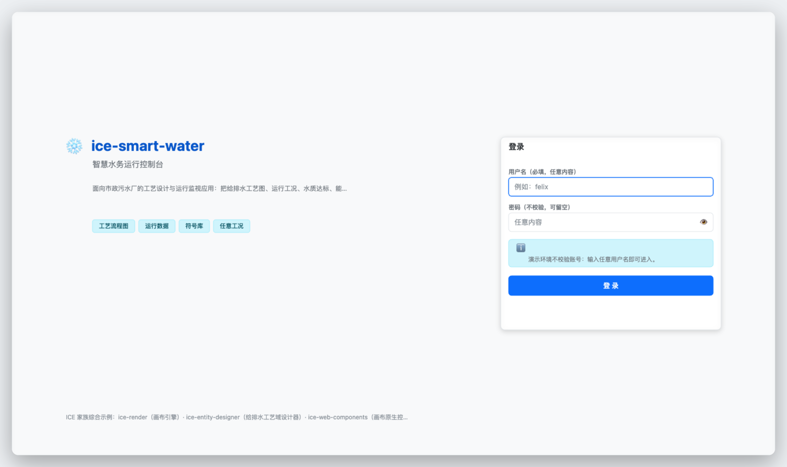
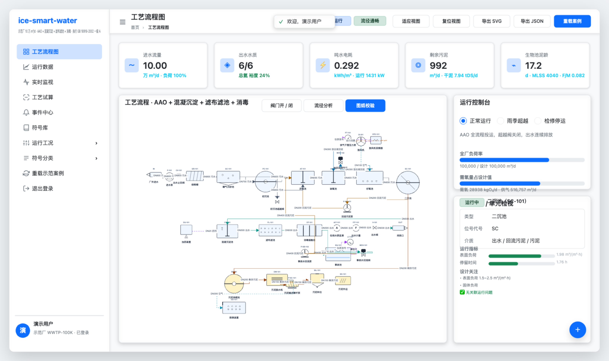
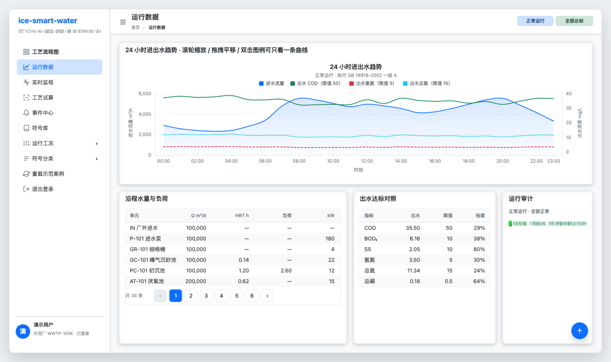
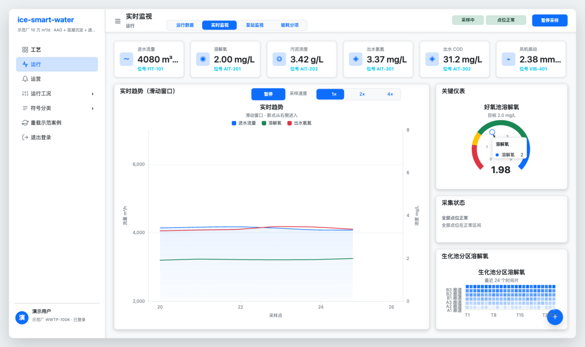
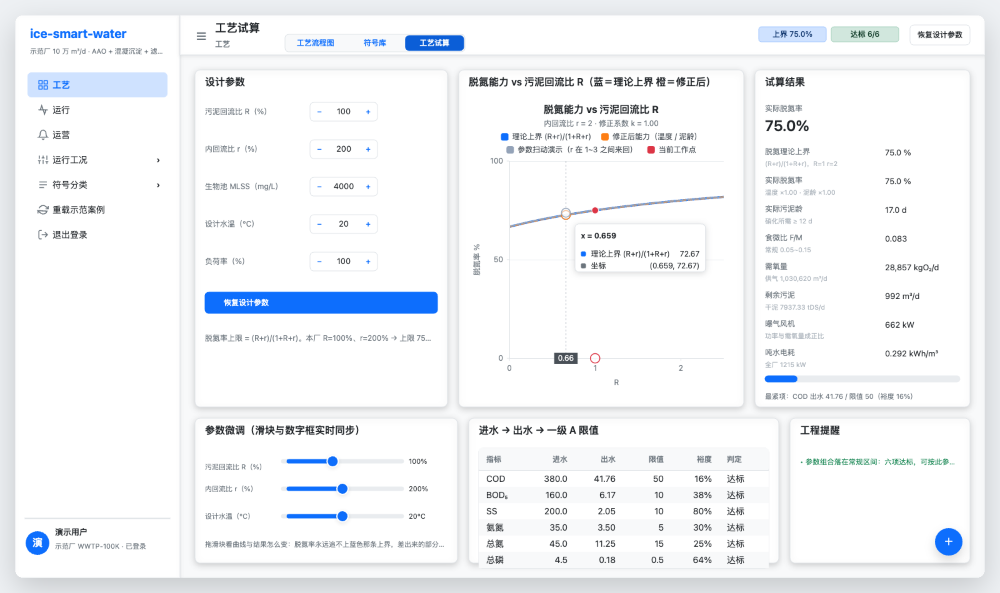
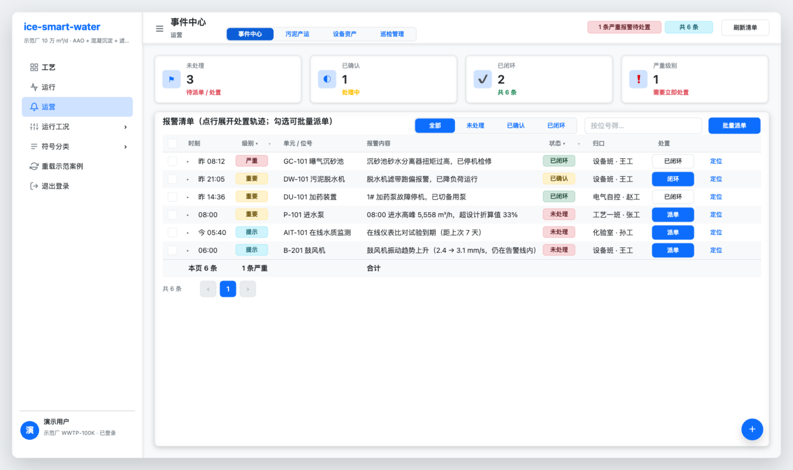
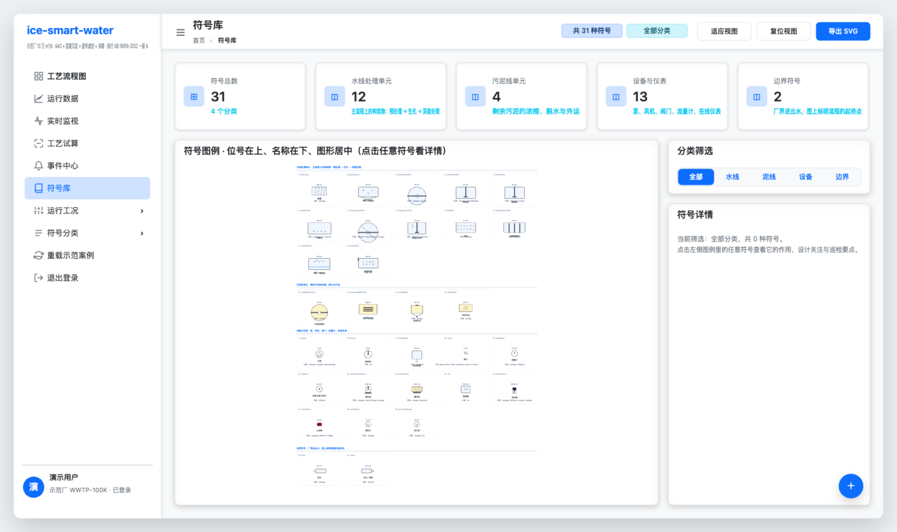
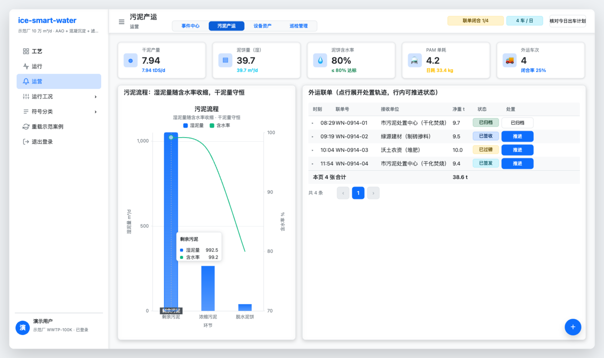
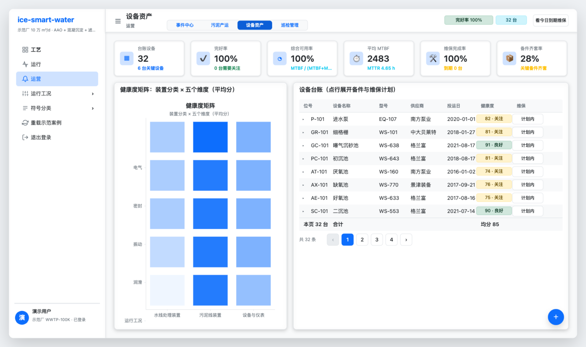
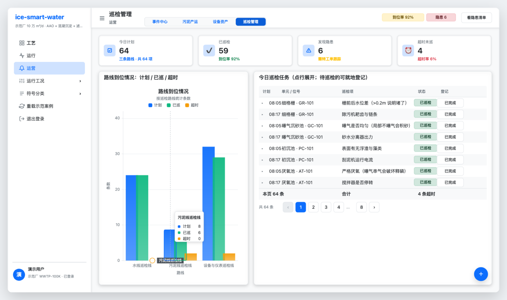

# ice-smart-water

智慧水务应用：**给排水工艺流程设计与运行监视**。

## 1. 概览

这个仓库是 ICE 家族的**应用侧样板** —— 它自己不实现渲染、图表、控件、领域设计器里的任何一件，
而是把家族四件套按同一个业务场景（一座 10 万 m³/d 的 AAO 市政污水厂）拼起来，
只写「水务这门生意」的逻辑。看这一页能知道家族各件东西**怎么组合、边界在哪里**。

### 1.1 一个入口、两级导航、九个页签

整个系统**只有一个 HTML**（`index.html`）：所有功能都在同一张画布外壳里，切页时只把对应的「岛」
摆出来（`display` 切换，不重新加载页面）。进应用先过**登录门**（见 [5](#5-登录门)）。

导航是**两级**：**侧栏列「域」，顶栏列该域的「页签」**。为什么非分两级不可——页签一多侧栏就放不下
（`ICEMenu` 没有滚动，高度 = 行数 × 40，一屏约 17 行）；分两级后侧栏只剩几个域项 + 几个动作项，
以后加业务场景只需往域里加页，侧栏永远不动。

| 域 | 页签 | 是什么 | 页里的岛 | 主用的家族能力 |
|---|---|---|---|---|
| 工艺 | **工艺流程图** | 全流程编辑器：P&ID 编辑（34 个单元 / 37 段管线，含信号与动力线）+ 图纸校验 + 流径分析 + 实时指标 | 工艺图（设计器） | `WaterProcessDesigner`、`ICEStatCard`、卡片 `extra` 插槽 |
| 工艺 | **符号库** | **31 种**给排水符号的图例 + 业务语义（作用 / 设计关注 / 巡检要点）+ 分类筛选 | 符号图例 | 域包符号库 + `ICESegmented` |
| 工艺 | **工艺试算** | 工程师调参台：R / r / MLSS / 水温 / 负荷率 → 脱氮上界、泥龄、需氧、电耗、达标裕度 | 试算曲线 | `ICEForm` + 校验、`ICEInputNumber`、`ICESlider`、`ICEStatistic`、`function` 系列 + **`sweep` 参数扫动** |
| 运行 | **运行数据** | 24 小时进出水趋势 + 沿程水量与负荷 + 出水达标对照 + 运行审计 | 24 小时看板 | `ICETable` 分页/空态、`ice-chart` 双 y 轴 |
| 运行 | **实时监视** | 模拟 SCADA 推送：6 个点位读数 + 三线滑动窗口趋势 + 溶解氧仪表 + 生化池分区热力图 | 趋势 / 仪表 / 热力图 | `appendData` 滑动窗口、`gauge`、`heatmap`、`ICESegmented`、`ICEButton` |
| 运营 | **事件中心** | 报警工单闭环：多选批量派单 + 行展开看处置轨迹 + 二次确认 + 通知 | — | `ICETable`（多选/展开/汇总/列筛选/自定义单元格）、`ICETimeline`、`attachPopconfirm`、`ICENotification` |
| 运营 | **污泥产运** | 污泥处理与处置：浓缩 → 脱水 → 泥饼外运，**转移联单**（签发 / 过磅 / 签收 / 归档）状态机与闭合率 | 污泥流程 | `ICETable` + 行展开 `ICETimeline`、`ICETag` 状态、`attachPopconfirm`；`ice-chart` 双轴（柱=湿泥量、线=含水率） |
| 运营 | **设备资产** | 设备全生命周期台账：**34 台设备由图上单元派生**（型号 / 供应商 / 投运日 / 健康度 / 维保计划 / 备件齐套） | 健康度矩阵 | `ICETable` + 健康度分档标签 + 展开备件；`ice-chart` **heatmap**（装置分类 × 五个健康维度） |
| 运营 | **巡检管理** | 巡检点位**由 `SYMBOL_CATALOG` 的「巡检要点」派生** → 三条路线 → 班次任务 → 到位率 / 隐患闭环 | 路线到位情况 | `ICETable` + 就地登记结论 + 展开详情；`ice-chart` 分组柱（计划 / 已巡 / 超时） |

内容由 `ice-entity-designer` 的两个示例（`examples/water-editor.html` / `water-symbols.html`）
迁移而来，但迁移后不再是两段写在 HTML 里的脚本，而是**一个工程里的六个页签**。

## 2. 界面截图

下面是运行中的真实截图（登录门 + 六个页签）。所有截图从当前代码由 `scripts/shoot-screenshots.mjs` 自动抓取
（与 e2e 共用同一套系统 Chrome 环境），分辨率 3200×1900，直接嵌入本页。

| 登录门 | 工艺流程图（选中二沉池 SC-101） |
|---|---|
|  |  |

| 运行数据 | 实时监视 |
|---|---|
|  |  |

| 工艺试算 | 事件中心 |
|---|---|
|  |  |

**符号库**：31 种给排水符号图例



| 污泥产运 | 设备资产 |
|---|---|
|  |  |

**巡检管理**：三条路线 × 班次任务 × 隐患闭环



## 3. 家族能力怎么用（本仓与四件套的边界）

### 3.1 四件套分工

| 包 | 在本应用里承担 | 本仓**不**做的事 |
|---|---|---|
| `ice-render` | 画布引擎：命中测试、拖拽、视口缩放平移、脏矩形局部重绘、矢量导出 | 不碰渲染管线、不写变换矩阵 |
| `ice-entity-designer` | 水工艺域设计器 `WaterProcessDesigner`：符号库 / 管线 / 走线 / 图纸校验 / 快照 / SVG | 不重写图元、不重写连线 |
| `ice-web-components` | 全部界面：侧栏菜单（`ICEMenu`）、面包屑、卡片（`ICECard`）、指标卡（`ICEStatCard`）、统计数（`ICEStatistic`）、表格（`ICETable` 多选/展开/汇总/列筛选/自定义单元格）、表单（`ICEForm` + `ICEFormItem` 校验）、滑块 / 数字框 / 分段控件 / 开关 / 标签、时间线、抽屉、二次确认、通知与消息 | 不画按钮、不做主题 token |
| `ice-chart` | 四种图：24 小时报表（双 y 轴折线 + 面积）、实时趋势（**`appendData` 滑动窗口**）、仪表（`gauge` 弹簧指针）、分区热力图（`heatmap` 滚动）、工艺试算曲线（`function` 系列 + **`sweep` 参数扫动** + `scatter` 工作点） | 不写绘制代码，只给声明式 option |

### 3.2 本仓只写业务

`src/domain` 里的厂站数据、水量平衡、污泥平衡、需氧量、能耗、沿程水质、运行工况、运行审计、
符号业务目录，都是**纯函数**。这一层**零运行时依赖**（只用兄弟包的类型），
所以能脱离浏览器单测（`npm test` 不起 jsdom、不加载任何引擎产物）。

## 4. 版面：整页画布化的 admin console

### 4.1 整体布局

界面语言对齐 `ice-web-components/examples/admin.html`：**侧栏（`ICEMenu`）+ 顶栏（标题 / 面包屑 /
状态标签 / 操作按钮）+ 内容卡片栅格（`ICEStatCard` / `ICECard` / `ICETable`）全部由
ice-web-components 画在同一张画布上**，页面里几乎没有 DOM —— 也就是说，连「导航、按钮、表格」
都是画出来的 Canvas 控件，而不是浏览器原生元素。

```
┌ 侧栏 264 ─┬ 顶栏 64 ──────────────────────────────────────────────────────────┐
│ 品牌       │ 标题 ·〔工况标签 流径标签〕·〔操作按钮…〕                          │
│ ICEMenu    │ 域：〔页签 ─ 页签 ─ 页签〕            ← 两级导航的第二级          │
│  工艺  ▸   ├──────────────────────────────────────────────────────────────────┤
│  运行      │ 内容区（24px 留白 + 18px 栅格）                                   │
│  运营      │  ┌ 统计卡 ─ 统计卡 ─ 统计卡 ─ 统计卡 ─ 统计卡 ┐                  │
│  运行工况 ▸│  ┌ 工艺流程（岛）──────────────┐ ┌ 运行控制台 ┐                  │
│  符号分类 ▸│  │  工艺图（独立画布 + 引擎）   │ ├ 运行要点 ──┤                  │
│  重载案例  │  └──────────────────────────────┘ └────────────┘                  │
│  退出登录  │                              ╱ 悬浮快捷按钮（导出 / 重载）         │
└────────────┴──────────────────────────────────────────────────────────────────┘
```

### 4.2 岛（island）= 独立画布 + 独立 `ICE` 实例

DOM 里一共 **10 张岛画布**，按**外壳坐标**绝对定位，嵌在外壳卡片挖好的「洞」里
（卡的正文区留空、岛画布透明底），视觉上就是「图长在卡里」：

| 岛 | 所在页签 | 为什么必须独立 |
|---|---|---|
| `island-process`（工艺图设计器） | 工艺流程图 | 滚轮缩放 / 拖拽平移走 `ICE.setViewport()`，它作用于**整个场景**——画在外壳那张画布上，侧栏与卡片会跟着图一起位移 |
| `island-board`（24 小时看板） | 运行数据 | `ice-chart` 的 `createChart()` 内部自己 `new ICE()`，天生一张独立画布 |
| `island-live-trend` / `-gauge` / `-heat`（趋势 / 仪表 / 热力图） | 实时监视 | 三张 `ice-chart`，同上 |
| `island-calc-curve`（试算曲线） | 工艺试算 | 一张 `ice-chart`，同上 |
| `island-legend`（符号图例） | 符号库 | 同一套域设计器再挂一张画布，图例自身也要独立视口 |
| `island-sludge-flow`（污泥流程） | 污泥产运 | `ice-chart` 双轴：湿泥量（柱）+ 含水率（线） |
| `island-asset-health`（健康度矩阵） | 设备资产 | `ice-chart` **heatmap**：装置分类 × 五个健康维度 |
| `island-inspection-route`（路线到位） | 巡检管理 | `ice-chart` 分组柱：计划 / 已巡 / 超时 |

岛的做法：DOM 里各放一个 `<div class="island">` + `<canvas>`；切页时由 `onIslands` 回调负责摆位，
并**隐藏不在本页的岛**（岛不在引擎显示树里，不处理会「飘着」）。

> **外壳之上还有一张 `#canvas-overlay`**（`pointer-events:none`）：顶部消息（`toast`）画在它上面。
> 原因：外壳画布在 DOM 里位于岛画布**之下**，画在外壳上的消息只要堆进岛的区域就会被岛盖住 ——
> ICE 的 `zIndex` 管不了 DOM 层叠。见 `view/shell.ts` 的 `messageOverlay`。

### 4.3 全工程一套坐标系

**全工程一套坐标系 = 画布绝对坐标**：外壳、卡片、岛用同一套数。
页面节点直接挂在画布根上（不塞进一个 content 容器里）—— 塞进去会让卡片再叠一次容器偏移，
症状是「卡片在右边偏 264px，而岛还留在原地、卡片和洞对不上」。

### 4.4 表单与长文本

**表单与长文本留在原生 DOM？不，这里没有 DOM 面板**：属性编辑改在图上直接点（选中 → 卡片上的
操作按钮），长文本（工况要点、审计条目、符号详情）用画布文本 + `style.wrap` 自动换行
（`estimateTextHeight()` 按 CJK 一字≈1em 估高，避免依赖构造期不准的 DOM 兜底测量）。

## 5. 登录门

首屏是一层**画布覆盖层**（`view/login.ts`），与外壳同一套设计语言：左侧品牌与介绍、
右侧登录卡（`ICETextField` / `ICEPasswordField` / `ICEButton` / `ICEAlert`，都是画布原生控件）。

- **不校验账号**：演示应用，用户名填任意内容即可进入（用户名必填、密码可留空）；
- 输入的名字会带进应用：侧栏底部署名 + 头像首字母 + 一条欢迎提示；
- 登录态存在 **`sessionStorage`**：同一标签页刷新不用重登；侧栏「退出登录」清掉它并回到登录门；
- 输入框聚焦时组件会挂一个**原生 `<input>` 替身**接键盘输入 —— 输入法、选中、退格、Enter 提交
  都是浏览器原生行为，不是自己实现的。

## 6. 数据流：图纸即数据源

```
设计器（可编辑的图）
   └─ adapter（唯一的接触点，把引擎的数据结构翻成扁平图描述）
        └─ domain 纯函数：走线 → 沿程水质 → 水量平衡 → 污泥平衡 → 能耗 → 运行审计
             └─ 视图：DOM 面板 / 画布控件 / 图表
```

**单向**：图上改 → 业务重算 → 界面刷新。所以关掉一台阀、删掉一段管线，
运行指标、出水达标判定、看板曲线会立刻跟着变；切到「雨季超越」工况，
二沉池表面负荷与停留时间会顶出设计区间并给出告警，而这些都是**算出来的**，不是写死的文案。

## 7. 业务模型的口径与自洽性

模型是**演示级**的（量级与工程惯例一致，自洽、可解释），不是设计软件。
取的口径都写在代码注释里，两条关键约束值得单独说：

1. **总氮的去除率上界由回流比决定**：AAO 的理论脱氮率 = (R+r)/(1+R+r)。本厂 R=100%、r=200%，
   上界 75%；实现的连乘去除率约 74.8%，正好贴着上界 —— 这就是「一级 A 里总氮最难达标」
   在模型里的体现（六项指标里它的裕度最小）。
2. **二沉池不接内回流**：内回流是生物池内部的循环（好氧池末端 → 缺氧池），把它算进二沉池
   会凭空抬高表面负荷 50%。水量平衡按 `Q(1+R)` 给二沉池、按 `Q(1+R+r)` 给好氧池。

设计参数为**演示取值**（污水厂设计参数的量级），不构成工程依据。

## 8. 运行与门禁

### 8.1 本地开发

```bash
npm install          # 四件套是 file: 链接到同级仓库，install 后就是软链
npm start            # webpack dev server，http://localhost:8092
```

### 8.2 在线演示

推送到 `master` 由 GitHub Actions 构建并发布到 GitHub Pages：

- **在线地址**：<https://ice-render.github.io/ice-smart-water/>
- 工作流：`.github/workflows/deploy.yml`（PR 只做构建校验，`master` 才部署）

> ICE 家族是四个**并列仓库**、不是 monorepo，所以工作流会把四个家族仓库签成**兄弟目录**，
> 按依赖顺序（`ice-render` 最先）各自构建，再构建本应用。

### 8.3 构建与静态服务

```bash
npm run build        # 产出 dist/index.html（单入口）+ dist/app.[hash].js
npm run serve        # 静态服务 dist（端口 8092）
```

### 8.4 质量门禁

```bash
npm run types:check  # tsc --noEmit
npm test             # jest：domain 纯逻辑单测
npm run test:e2e     # playwright：端到端回归（含版面体检，先自动 build）
npm run verify       # types:check + test + build
```

### 8.5 版面体检

`e2e/layout.spec.ts` 把每个页面里「我排的容器」的矩形两两比一遍，断言**零相交、零出界、零滚动条**；
并且有一条**敏感度自检** —— 故意把一张卡压到另一张上，体检必须抓得住（否则这个测试就是摆设）。
这类问题截图看不出来（人眼容易当成设计）。

> `@playwright/test` 用 `channel: 'chrome'`（系统 Chrome）。Playwright 自带的无头壳版本
> 与本地缓存经常对不上，用系统 Chrome 能绕开这个坑。

## 9. 目录结构

```
public/            唯一入口页的 HTML 模板（外壳画布 + 登录层画布 + 消息覆盖画布 + 7 个岛容器；脚本由 webpack 注入）
src/
  domain/          业务逻辑（纯函数、可单测，唯一允许 import 的是兄弟包的类型）
    water-quality.ts    水质指标 / GB 18918-2002 一级 A 限值 / 达标判定与裕度
    plant-case.ts       示范厂业务数据：单元设计参数、管径、回流比、去除率、常闭阀
    plant-graph.ts      扁平的工艺图描述 + 走线（沿管线声明方向，备用通路降优先级 + 断点定位）
    process-model.ts    水量平衡 / HRT / 表面负荷 / 污泥平衡 / 需氧量 / 能耗 / 沿程水质 / 24h 模拟
    operating-modes.ts  运行工况：阀位 + 停运单元 + 水量水质修正 + 运行要点
    plant-audit.ts      运行审计：达标、裕度、停运影响、负荷与泥龄校核
    symbol-catalog.ts   31 种符号的业务目录（分类 / 位号代号 / 介质 / 作用 / 巡检要点）+ 位号规则
    daily-profile.ts    日变化曲线（均值归一化为 1）+ 确定性伪随机（同种子同曲线）
    live-signal.ts      实时点位（量程 / 阈值 / 尖峰）+ 阈值判定 + 分区溶解氧矩阵滚动
    sizing.ts           参数化试算：脱氮上界 (R+r)/(1+R+r)、温度与泥龄修正、需氧 / 污泥 / 电耗
    alarm-log.ts        报警事件：审计条目 + 24h 越限小时 + 工况事件 → 派单 / 确认 / 闭环
    sludge-manifest.ts  污泥产运：沿流程折算（干泥守恒）+ 外运联单状态机 + 处置成本
    asset-registry.ts   设备台账：单元派生 + 健康度 / MTBF / 维保计划 / 备件（hashOf 确定性）
    inspection.ts       巡检：点位由符号目录的「巡检要点」派生 + 班次任务 + 到位率 / 隐患闭环
  view/            与家族打交道的一层
    adapter.ts          设计器 → 扁平图（引擎结构与业务结构之间唯一的接触点）
    shell.ts            画布化外壳：侧栏 ICEMenu / 顶栏 / 卡片栅格 / 页签切换 / 岛的回调 / 消息覆盖画布
    login.ts            登录门：画布覆盖层 + 表单 + sessionStorage 登录态
    islands.ts          岛的摆位与显隐（DOM 画布按外壳坐标嵌进卡片的洞）
    canvas-viewport.ts  岛的铺满容器 + 滚轮锚点缩放 + 拖拽平移
    board.ts            图表装配 + option 构造（ice-chart）
    symbol-legend.ts    符号图例的版面计算（纯函数）与渲染
    pages/              九个页面：process / data / live / calc / events / legend / sludge / asset / inspection
  entries/app.ts   唯一入口（只做装配与状态编排，不写业务规则）
tests/domain/      jest 单测（镜像 domain 结构）
e2e/               Playwright 端到端 + 画布断言工具（按坐标点控件、按像素验绘制）
.github/workflows/ GitHub Pages 部署工作流
```

## 10. 与家族其它仓库的关系

- 四个依赖都是 `file:../<repo>`，本地开发时改完兄弟仓库 `npm run build` 即可吃到新版本。
- 每个包的 `node_modules` 里都躺着一份自己装的 `ice-render`（版本甚至不同），
  直接用 node 的解析规则打包会解析出**多份引擎实例**，`typeId` 注册与事件总线会错位。
  `webpack.config.js` 把四个包**全部 alias 到同级仓库目录**，强制全工程只有一份 `ice-render`。
- 上游的 `examples/water-editor.html` / `examples/water-symbols.html` 仍留在
  `ice-entity-designer`（它自己的 e2e 依赖那两个页面）；本仓的入口是**重写过的工程版**，
  不是那两个文件的镜像。

## 11. License

MIT © 大漠穷秋
